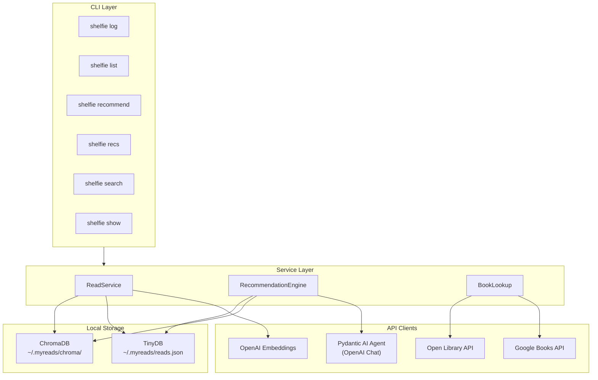
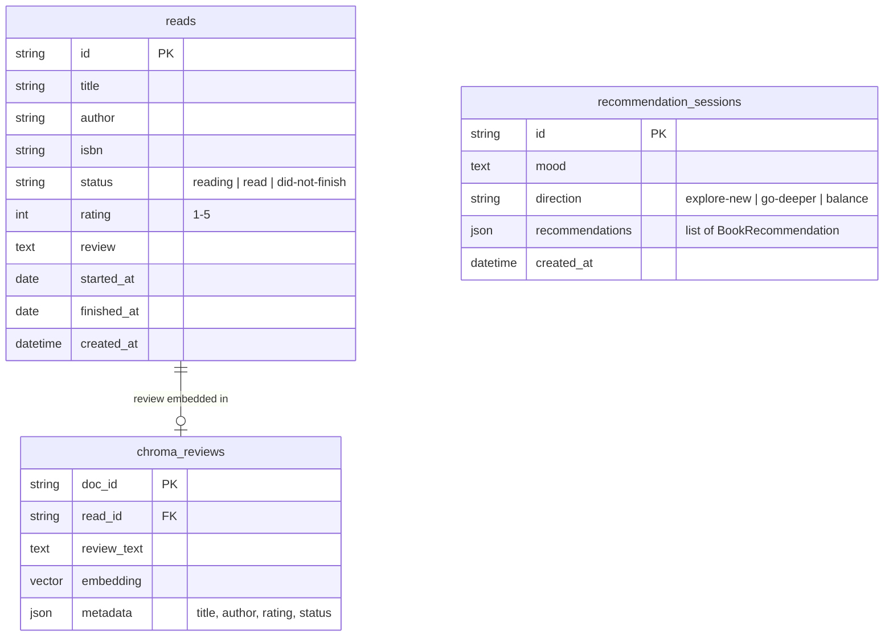
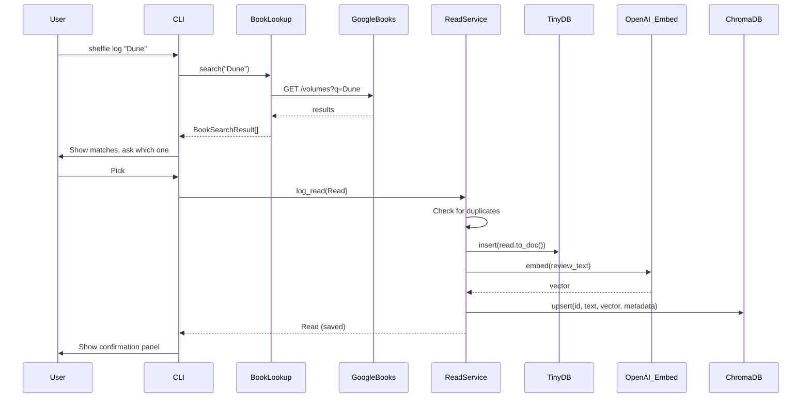
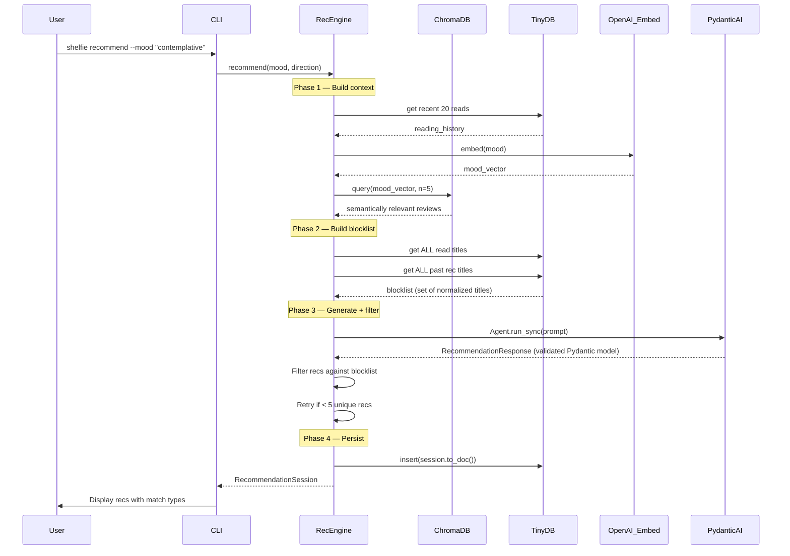

# Shelfie — Architecture Reference

## Design Philosophy

**Store the reader, not the books.** Shelfie only persists personal data — your reads, reviews, and recommendation sessions. Book metadata is fetched live from external APIs every time, keeping things simple and always up-to-date.

---

## Project Structure

```
src/shelfie/
├── cli.py                    # Typer CLI — all user-facing commands
├── config.py                 # Settings via pydantic-settings + .env
├── models.py                 # Pydantic models (Read, BookRecommendation, etc.)
├── storage.py                # Dual storage manager (TinyDB + ChromaDB)
├── apis/
│   ├── google_books.py       # Google Books API client
│   ├── open_library.py       # Open Library API client
│   └── openai_client.py      # OpenAI embeddings + Pydantic AI recommendation agent
└── services/
    ├── book_lookup.py         # Multi-API search with fallback
    ├── reads.py               # ReadService — log, list, embed reviews
    └── recommendations.py     # RecommendationEngine — context building + post-filtering
```

---

## Layer Diagram



---

## Data Model

### What's stored locally



### What's fetched live (never stored)

- Book descriptions, genres, page counts — Google Books / Open Library
- Search results
- External ratings

---

## Key Flows

### `shelfie log "Book Name"`



### `shelfie recommend --mood "..." --direction explore-new`



---

## Storage Details

### TinyDB (`~/.myreads/reads.json`)

A single JSON file with two tables:
- **reads** — your reading log
- **sessions** — recommendation session history

Queried using TinyDB's `Query` objects. Duplicate detection uses case-insensitive title + author matching.

### ChromaDB (`~/.myreads/chroma/`)

Persistent vector store with one collection:
- **reviews** — embedded review text with metadata (title, author, rating, status)

Uses cosine similarity. Vectors are generated via OpenAI's `text-embedding-3-small` model. Queried by embedding the user's mood and finding the most semantically relevant past reviews.

---

## Recommendation Strategy

The engine does NOT stuff the prompt with your entire library. Instead:

1. **Lean prompt** — only recent reads (last 20) with reviews go to the LLM for taste understanding
2. **Semantic retrieval** — ChromaDB finds the 5 reviews most relevant to the current mood (even without keyword overlap)
3. **Post-filtering** — after the LLM responds, recommendations are checked against a local blocklist of all reads + all past recs. Duplicates are dropped.
4. **Retry loop** — if filtering removes too many, the engine retries (up to 2x) to fill the gap

This scales to any library size — the blocklist is a `set[str]` in memory, never part of the prompt.

### Pydantic AI Integration

Recommendations use a Pydantic AI `Agent` with `output_type=RecommendationResponse`. This means:
- The LLM is forced to return structured data matching the schema
- Output is automatically validated as a list of `BookRecommendation` objects
- No manual JSON parsing — `result.output.recommendations` gives typed Python objects
- `match_type` (safe bet / stretch pick / wild card) is an enum validated at parse time

---

## Tech Stack

| Layer | Technology | Why |
|---|---|---|
| CLI | `typer` + `rich` | Type-hint based commands, beautiful terminal output |
| Data models | `pydantic` | Validation, serialization, schema generation |
| Config | `pydantic-settings` | `.env` file loading with typed defaults |
| Document store | `tinydb` | Zero-setup JSON-file database |
| Vector store | `chromadb` | Local persistent embeddings with cosine search |
| LLM | `pydantic-ai` | Typed agent with validated structured output |
| Embeddings | `openai` SDK | Review embedding via text-embedding-3-small |
| HTTP | `httpx` | Modern async-capable HTTP client |
| Book data | Google Books + Open Library APIs | Free, no auth required |
