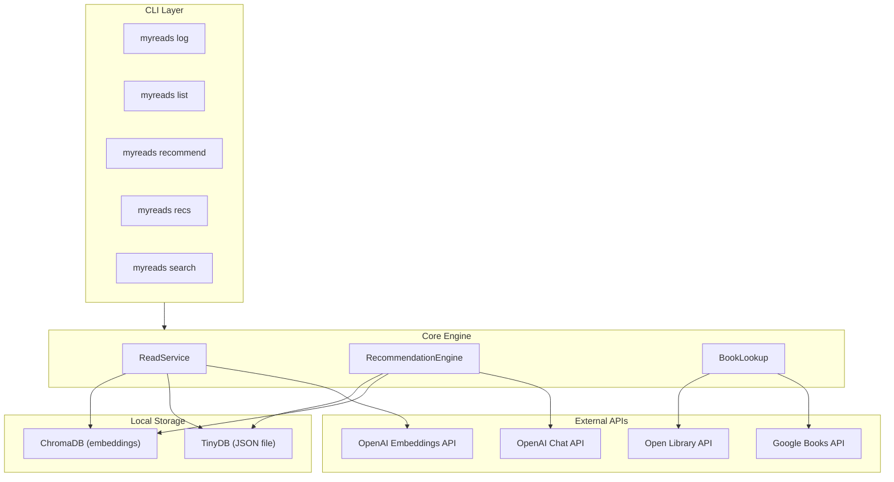
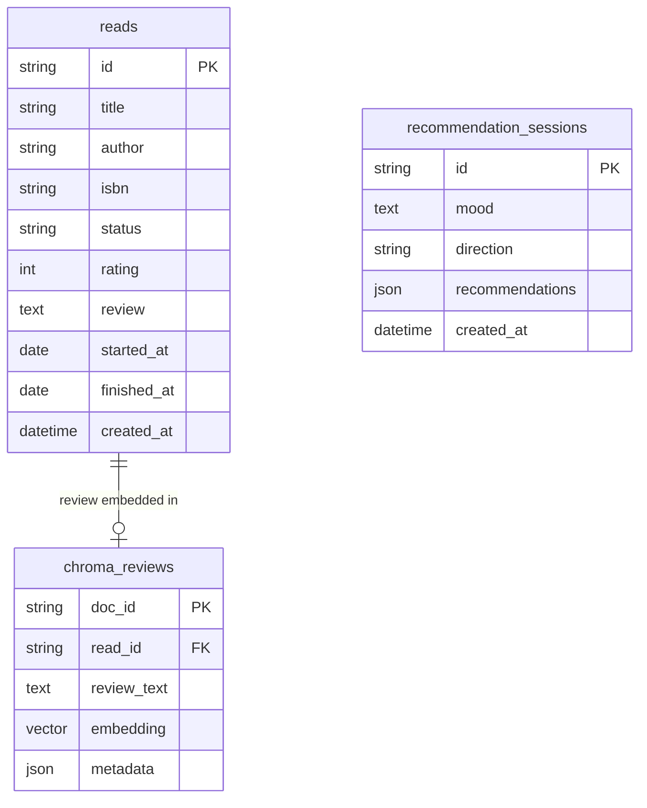

# MyReads — Personalized Book Recommendation Engine

## Core Principle

**No local book catalog.** Books are ephemeral data fetched live from APIs. The only thing stored locally is *you* — your reading history, your reviews, your recommendation sessions. This keeps the system simple and the data always fresh.

## Version Roadmap

### V0 — Foundation (detailed below)

Local CLI + TinyDB + ChromaDB + OpenAI. Log reads with ratings/reviews (embedded in ChromaDB for semantic retrieval), fetch book data live from APIs, get LLM-powered recommendations that understand your history, mood, and direction preference.

### V1 — Smarter Loop

- Recommendation feedback (mark recs as "read it", "not interested", "loved it") — feeds back into future prompts
- Goodreads CSV import for bootstrapping reading history
- Reading pattern analysis (auto-detect genres you're gravitating toward or away from)
- Richer prompts with rolling context windows over embedded history

### V2 — Rich Context

- Pull aggregated reviews from multiple sources to feed into recommendation prompts
- Reading lists / shelves (e.g., "want to read", "favorites", "re-read")
- Semantic search over your reading history ("that book about grief and resilience")
- Optional TUI upgrade (using `textual`)

### V3 — Advanced Intelligence

- Reading statistics and insights dashboard
- Export/sync capabilities
- Multi-LLM provider support (Anthropic, local models via Ollama)
- Conversational recommendation mode (back-and-forth refinement)

---

## V0 — Detailed Design

### Architecture




### What's Stored Locally vs. Fetched Live

**Stored locally (your personal data only):**

- **Reads** (TinyDB + ChromaDB): title, author, ISBN (just enough to re-identify the book), your rating (1-5), your review, status, dates. The review text is also embedded in ChromaDB for semantic retrieval.
- **Recommendation sessions** (TinyDB): the mood you asked for, direction preference, what was recommended, timestamps, outcome status.

**Fetched live from APIs (never stored):**

- Book descriptions, genres, page counts, covers — from Google Books / Open Library
- Search results when looking up books
- External ratings / review summaries (where available from APIs)

### Data Model




- **reads** (TinyDB): Your reading log — minimal book identity + your personal data (rating, review, status)
- **recommendation_sessions** (TinyDB): Each time you ask for recs, the full session is saved — mood, direction, and the list of recommendations with reasons
- **chroma_reviews** (ChromaDB): Your review text embedded as vectors, with metadata (title, author, rating, genres) for filtered semantic search

### Project Structure

```
myreads/
  pyproject.toml           # Project config, dependencies
  README.md
  .env.example             # Template for API keys
  src/
    myreads/
      __init__.py
      cli.py               # Typer CLI commands
      storage.py            # TinyDB + ChromaDB setup and access
      models.py             # Pydantic models
      services/
        __init__.py
        reads.py            # Reading log management + embedding
        recommendations.py  # LLM recommendation engine
        book_lookup.py      # Live book search via APIs
      apis/
        __init__.py
        google_books.py     # Google Books API client
        open_library.py     # Open Library API client
        openai_client.py    # OpenAI embeddings + chat completions
      config.py             # Settings (API keys, data dir path)
```

### Tech Stack

- **CLI framework**: `typer` — type-hint based, auto-generated help, clean UX
- **Output formatting**: `rich` — tables, panels, markdown rendering in terminal
- **Document store**: `tinydb` — JSON-file-backed document DB, zero setup
- **Vector store**: `chromadb` — local embeddings store with metadata filtering, persistent on disk
- **HTTP client**: `httpx` — async-capable, modern Python HTTP
- **LLM + Embeddings**: `openai` Python SDK — chat completions for recs, embeddings for reviews
- **Data validation**: `pydantic` — models for reads, sessions, API responses
- **Config**: `.env` file via `python-dotenv`

### CLI Commands

**Reading log (conversational):**

- `myreads log "Sapiens"` — Starts a conversational flow:
  1. Searches APIs for the book name
  2. If multiple matches, shows numbered results and asks which one (clarifies author/edition)
  3. Asks for your rating (1-5)
  4. Asks for your review (free text, optional — press Enter to skip)
  5. Asks for status (read / reading / did-not-finish, defaults to "read")
  6. Confirms and saves
- All steps are interactive prompts — no flags needed
- `myreads list` — Show reading history (filterable by status, rating)
- `myreads show <read_id>` — Show a read with your review + live-fetched book details from API

**Book search (live, no local storage):**

- `myreads search "sapiens"` — Search Google Books / Open Library, display results with descriptions

**Recommendations (the core feature):**

- `myreads recommend` — Interactive: prompts for mood and direction, then generates recs
- `myreads recommend --mood "something contemplative about mortality" --direction explore-new` — Direct invocation
- `myreads recommend --mood "hard sci-fi" --direction go-deeper` — Continue in a genre
- `myreads recs` — View past recommendation sessions and their outcomes

The `--direction` flag is key to the use case:

- `explore-new`: Actively move away from recent genres/topics
- `go-deeper`: Find more like your recent highly-rated reads
- `balance`: Mix of familiar comfort and new territory (default)

### Recommendation Prompt Strategy

The recommendation engine builds a rich context from two sources before calling the LLM:

**1. Semantic retrieval (ChromaDB):**

- Embed the user's current mood/ask
- Query ChromaDB for the most semantically relevant past reviews
- This surfaces reads that *feel* related to the current ask, even without keyword overlap
- Example: mood "existential dread" might pull up your review of "The Stranger" even if you never used those exact words

**2. Structured history (TinyDB):**

- Recent reads with ratings (last N)
- Past recommendation sessions (to avoid repeats)
- Rating distribution (what you tend to rate highly)

**Combined prompt to OpenAI:**

- System prompt with role + output format instructions
- Semantically relevant past reads with your reviews (from ChromaDB)
- Recent reading history summary (from TinyDB)
- Current mood/ask from the user
- Direction preference with explicit instructions
- Anti-patterns: books already read, books already recommended
- Output: structured JSON array of recommendations (title, author, reason, confidence_score)

### Configuration

A `.env` file at the project root (or `~/.myreads/.env`):

```
OPENAI_API_KEY=sk-...
GOOGLE_BOOKS_API_KEY=...          # optional, unauthenticated access works but is rate-limited
MYREADS_DATA_DIR=~/.myreads      # TinyDB JSON + ChromaDB persist directory
OPENAI_MODEL=gpt-4o              # configurable model for recommendations
OPENAI_EMBEDDING_MODEL=text-embedding-3-small  # for review embeddings
```

### Key Implementation Details

- **Data directory** at `~/.myreads/` — contains `reads.json` (TinyDB) and `chroma/` (ChromaDB persist dir)
- **Auto-init**: Data directory and stores created on first run
- **Book identity**: When logging a read, the system searches APIs to confirm the book and grab the ISBN. The ISBN is stored as the canonical identifier for deduplication, with title+author as fallback.
- **Embedding on write**: When you log a read with a review, the review is immediately embedded and stored in ChromaDB with metadata (title, author, rating, genres)
- **Structured LLM output**: Use OpenAI's `response_format` with JSON schema for reliable parsing
- **Rich CLI output**: Recommendations displayed as formatted panels with reasons; reading history as tables
- **Graceful API fallback**: If Google Books is unavailable, fall back to Open Library, and vice versa

